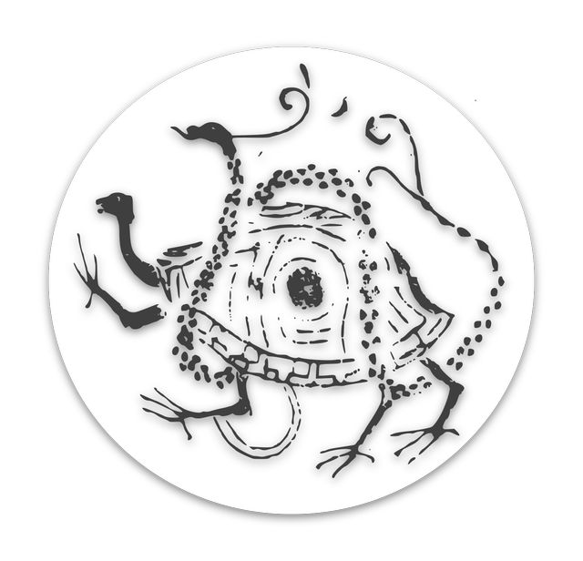

# DarkWarrior

## 开源说明

DarkWarrior是我在2016年带领团队创业开发的项目，这两年一直躺在硬盘里，不如开源出来分享给大家。
由于产品设计是在2015年做的，前端使用bootstrap实现，后端使用django 1.8，现在来说有点老，但程序本身很好用，只要剔除掉不用的app即可。

## 产品功能
玄武是针对影视特效和动画行业的项目流程管理系统，基于图形图像行业流行的 Python开发语言，整合现有CG工作流程，通过看板、甘特图、日历的展现可以更容易的管理工作和艺术家，可以随时根据突发状况对计划进行监督和调整，无论您在什么地点只要有网络环境就可以进行沟通。可以轻松管理您所有动画、特效项目，在线Web访问，从中调取任何的项目、任务、资产、镜头进行协同审查或团队沟通。

主要功能包括：

项目跟踪：
项目跟踪是每个项目的核心，玄武为您提供了很好的多项目支持，通过历程规划、甘特图、时间线等跟踪工具，您可以通过项目跟踪看到整个项目的全貌并配有批处理表格等，可以轻松管理您所有项目。

敏捷管理：
利用看板等轻量级工具，从管理职能的发挥最优化转向顾客机遇和信息利用的最优化。

工作审查：
协同审查在玄武中只需要一个简单的拖拽，或者点击。可以使用看板、日历或者甘特图调取任何的任务、资产或镜头，浏览视频小样或者图片进行进度的沟通，也可以在web页面直接注释图片或者视频。

版本管理：
使用在CG领域常用的SVN版本库功能，将版本文件上传到玄武系统中，我们将对它们进行管理。由于玄武是一个分层的项目管理系统可以直接链接版本的下一个项目或任务。

计划和调度：
玄武系统有强大的计划工具，轻量级敏捷管理的看板功能，以及日历、甘特图的展现让您可以更容易的管理工作和艺术家可以随时根据突发状况对计划进行微调。

集成：
玄武在您的工作流程中将是一个伟大的桥梁，凭借强大的Python Django框架接口，以及SVN版本管理功能，可以将海量的插件整合在现有工作流程，我们现在已经整合了Unreal，MAYA应用。

IM：
系统提供XMPP即时通讯功能，直接对单个任务进行沟通。

安全：
作为一个工作流系统，如何有效地保障用户的数据安全是重中之重。玄武提供你了HTTPS连接，可以对用户的信息安全进行更有效地保障。

角色管理：
使用玄武系统可以轻松管理所有项目，为艺术家、制片人和管理者制定任务的优先级，掌控每一个艺术家的工作状态，减少沟通成本合理的分配现有资源，在线交流减少误差。

团队管理：
玄武系统可以通过团队、用户组等管理策略，指定用户权限。

## 后续
这个版本不计划维护了，代码供使用和参考。

有时间我将重写DarkWarrior，升级成DarkWarrior 2.0，将主要关注敏捷管理部分。
